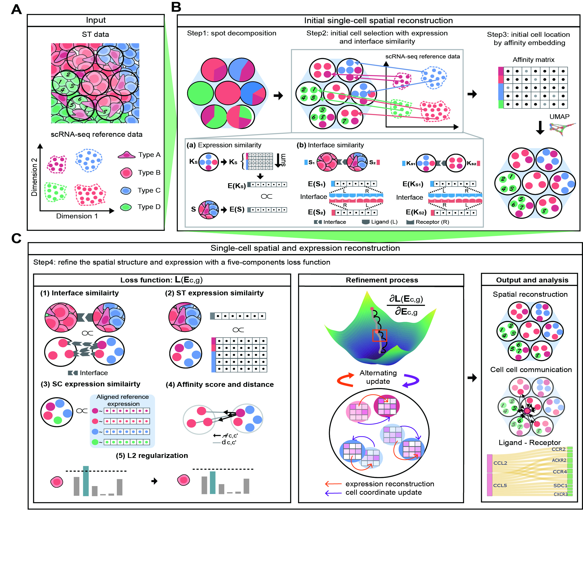

# StrInt

StrInt reconstructs spot-level spatial transcriptomics data at single-cell resolution. It combines a spatial expression matrix, spot coordinates, cell-type deconvolution weights, and a single-cell reference to select candidate cells for each spot and refine their expression profiles. Ligand-receptor information is used to model local cell-cell interactions.

The package implements the method described in *Deciphering more accurate cell-cell interactions by modeling cells and their interactions*.



## What it provides

- Input preparation and gene alignment for spatial and single-cell data.
- Deconvolution-guided cell selection for each spatial spot.
- Gradient-based refinement of reconstructed single-cell expression.
- Built-in Human and Mouse ligand-receptor reference tables.
- Utilities for evaluation, visualization, cell-cell interaction analysis, and selected downstream pipelines.

## Installation

StrInt currently targets Python 3.9. Create an isolated environment, install the dependencies, and install this checkout in editable mode:

```bash
conda create -n strint python=3.9
conda activate strint
python -m pip install --upgrade pip
python -m pip install -r requirements.txt
python -m pip install -e .
```

For a regular installation from a source archive or clone, use `python -m pip install .`. The package name is `pyStrint`; the importable modules are under `pyStrint`.

## Input data

| Object | Type and orientation | Required contents |
| --- | --- | --- |
| `sc_exp` | `pandas.DataFrame`, cells × genes | Single-cell expression; index must identify cells. |
| `sc_meta` | `pandas.DataFrame`, cells × metadata | A cell-type column, passed as `cell_type_key`; index must match `sc_exp`. |
| `st_exp` | `pandas.DataFrame`, spots × genes | Spatial expression; index must identify spots. |
| `st_coord` | `pandas.DataFrame`, spots × coordinates | `x` and `y` coordinate columns; index must match `st_exp`. |
| `st_weight` | `pandas.DataFrame`, spots × cell types | Deconvolution weights/counts; row index must match spatial spots and columns must match reference cell types. |
| `sc_distribution` / `sc_ref` | cells × genes | Per-cell reference distribution, aligned to the single-cell reference. |
| `lr_df` | ligand-receptor pairs | Optional custom ligand-receptor table. If omitted, the bundled Human or Mouse table is used. |

`pp.prep_all_adata()` removes incompatible genes, scales expression, creates `AnnData` objects, and returns an aligned ligand-receptor table. Use `SP="Human"` or `SP="Mouse"` (with the same species passed to `strInt`). For already prepared data, provide compatible `AnnData` objects and a cell-by-gene `sc_ref` directly.

`st_tp` controls spatial-neighborhood construction and accepts `"st"`, `"visium"`, or `"slide-seq"`.

## Main workflow

1. Prepare inputs with `pyStrint.preprocess`.
2. Construct `strInt` and call `prep()` to validate inputs and construct spatial affinity profiles.
3. Call `select_cells()` to allocate single cells to spots according to the deconvolution weights and expression similarity.
4. Call `gradient_descent()` to refine the selected cell profiles and infer their embedding.
5. Use `pyStrint.evaluation` and `pyStrint.plotting` for downstream evaluation and figures.


## Outputs

The output directory contains at least:

- `refined_sc_exp.tsv`: reconstructed/refined cell-by-gene expression matrix.
- `loss.tsv`: loss terms recorded during refinement.

The selected/refined metadata is returned by the API and can be saved explicitly by the calling script.

## Optional downstream tools

Some functions in `pyStrint.evaluation` invoke external R or Python tools (for example KEGG/clusterProfiler and SpatialDE). They are not required for the core reconstruction workflow. Install and configure those tools separately before calling their corresponding wrappers; see the source code for their expected command-line environments.

## Repository layout

```text
pyStrint/          Core package and bundled ligand-receptor tables
tutorial/demo/     Small TSV input dataset
assets/            Figure used in this README
```

This release intentionally contains only the distributable package and a minimal runnable input dataset. Intermediate results, dataset-specific analyses, notebook checkpoints, caches, and compiled Python artifacts are excluded.

## License

StrInt is distributed under the [MIT License](LICENSE).
